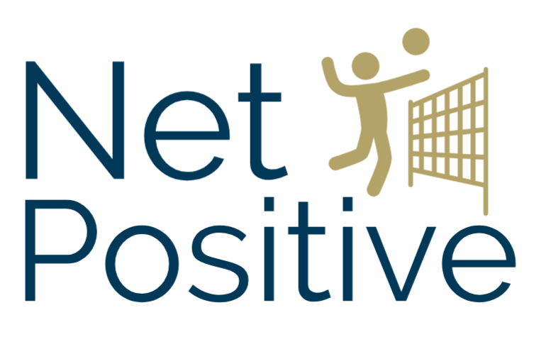

## Background
Winner of the Sports Innovation Challenge. Check out our [devpost submission!](https://devpost.com/software/sportshackathon)

## Inspiration
Georgia Tech's volleyball team uses a wearable called myVERT, which they wear during games and practices. This wearable tracks jump height and impact velocity. Coaches would like to use this data to help them better train the team, but sifting through hundreds of thousands of lines of data and analyzing it is not in their job description. Instead, NetPositive helps surface the valuable data insights that coaches care about, allowing coaches to make data-driven recommendations for their players. 

## What it does
NetPositive is an interactive interface for coaches to view and understand valuable data insights about their players. NetPositive allows you to pull data from myVERT, upload it to a Georgia Tech controlled database, and generate analytics for your team over time. You can see how your players stack up against each other, trends over the season, and correlate player statistics with box scores. You can even view impact data over time, allowing you to monitor your player for injuries. 

## How we built it
We started with user research. We talked to one of the coaches from the volleyball team, and learned about specific pain points that the coaches were experiencing when they were coaching the team during the practices.

The data is stored in AWS DynamoDB. When a session's data csvs are pulled from myVERT, a script can be run to automatically upload them to AWS. 

The data analytics are run using Python's pandas library, and visualizations are generated using matplotlib. 

The user interface is built with Sketch for low fidelity wireframe. While the actual interactive function was then put into Invision, and was tweeked with the front end coding embedded in Invision.

## Challenges we ran into
Pulling data from various sources and sanitizing it into a usable format was a large challenge given the heterogeneity of the data. Pulling csv files from myVERT and processing provided Excel spreadsheets to get into one data type took a long time. 

For the contextual research, because of the pressured timeline, we did a quick open ended question session with the Associate director of Sports medicine, coach Carla Gilson, to understand her overall experience with treating the ladies' Volleyball team.

## Accomplishments that we're proud of
The creation of a product that used multiple backgrounds to produce a product that functions from the back end and provides an UI system that is built around the needs of the user. 

## What we learned
The importance of communication in a team where there are multiple objectives. If the communication is clear everybody will be able to understand the direction of the project. Working in an interdisciplinary team allows all the students to discuss their ideas in a way that they would not normally discuss which leads to a greater understanding of the entire project.

## Other
Here is our [user experience.](https://projects.invisionapp.com/share/CFOXMGJX9WJ)

